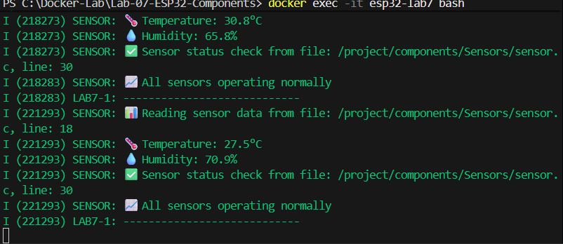
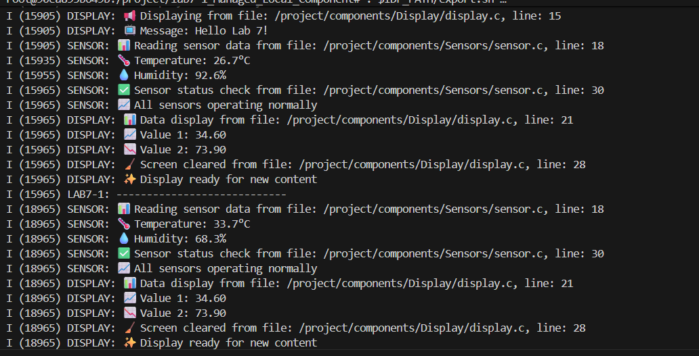

คำสั่งที่ใช้
# เข้าไปใน project directory
cd lab7-1_Managed_Local_Component

#export environment เพื่อให้สามารถเรียกใช้ idf tools ได้
. $IDF_PATH/export.sh

# กำหนด target ESP32
idf.py set-target esp32

# Build project
idf.py build

# รัน QEMU (สำหรับการทดสอบ)
idf.py qemu monitor

ผลลัพธ์ที่ได้

2. 